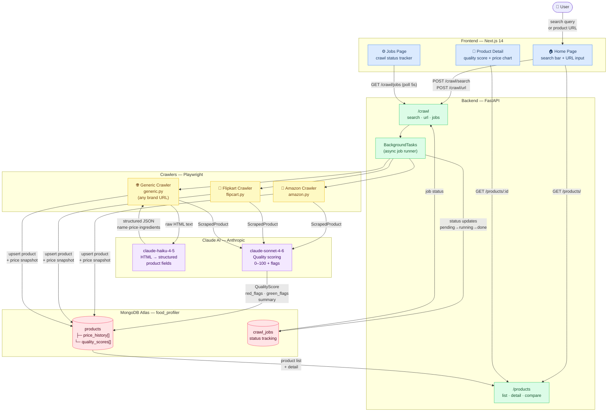

# Architecture Diagram

```mermaid
flowchart TD
    User(["👤 User"])

    subgraph Frontend["Frontend — Next.js 14"]
        Home["🏠 Home Page\nsearch bar + URL input"]
        Detail["📄 Product Detail\nquality score + price chart"]
        Jobs["⚙️ Jobs Page\ncrawl status tracker"]
    end

    subgraph API["Backend — FastAPI"]
        ProdRouter["/products\nlist · detail · compare"]
        CrawlRouter["/crawl\nsearch · url · jobs"]
        BgTask["BackgroundTasks\n(async job runner)"]
    end

    subgraph Crawlers["Crawlers — Playwright"]
        Amazon["🛒 Amazon Crawler\namazon.py"]
        Flipkart["🛒 Flipkart Crawler\nflipcart.py"]
        Generic["🌐 Generic Crawler\ngeneric.py\n(any brand URL)"]
    end

    subgraph AI["Claude AI — Anthropic"]
        Haiku["claude-haiku-4-5\nHTML → structured\nproduct fields"]
        Sonnet["claude-sonnet-4-6\nQuality scoring\n0–100 + flags"]
    end

    subgraph DB["MongoDB Atlas — food_profiler"]
        Products[("products\n├─ price_history[]\n└─ quality_scores[]")]
        CrawlJobs[("crawl_jobs\nstatus tracking")]
    end

    %% User interactions
    User -->|"search query\nor product URL"| Home
    Home -->|"POST /crawl/search\nPOST /crawl/url"| CrawlRouter
    Home -->|"GET /products/"| ProdRouter
    Jobs -->|"GET /crawl/jobs (poll 5s)"| CrawlRouter
    Detail -->|"GET /products/:id"| ProdRouter

    %% API internals
    CrawlRouter --> BgTask
    BgTask --> Amazon
    BgTask --> Flipkart
    BgTask --> Generic

    %% Crawlers → AI
    Generic -->|"raw HTML text"| Haiku
    Haiku -->|"structured JSON\nname·price·ingredients"| Generic

    %% Crawlers → Quality Analysis
    Amazon -->|"ScrapedProduct"| Sonnet
    Flipkart -->|"ScrapedProduct"| Sonnet
    Generic -->|"ScrapedProduct"| Sonnet

    %% AI → DB
    Sonnet -->|"QualityScore\nred_flags · green_flags\nsummary"| Products

    %% Crawlers → DB
    Amazon -->|"upsert product\n+ price snapshot"| Products
    Flipkart -->|"upsert product\n+ price snapshot"| Products
    Generic -->|"upsert product\n+ price snapshot"| Products

    %% Job tracking
    BgTask -->|"status updates\npending→running→done"| CrawlJobs

    %% DB → API
    Products -->|"product list\n+ detail"| ProdRouter
    CrawlJobs -->|"job status"| CrawlRouter

    %% Styles
    classDef frontend fill:#dbeafe,stroke:#3b82f6,color:#1e3a5f
    classDef api fill:#dcfce7,stroke:#22c55e,color:#14532d
    classDef crawler fill:#fef9c3,stroke:#eab308,color:#713f12
    classDef ai fill:#f3e8ff,stroke:#a855f7,color:#3b0764
    classDef db fill:#ffe4e6,stroke:#f43f5e,color:#4c0519

    class Home,Detail,Jobs frontend
    class ProdRouter,CrawlRouter,BgTask api
    class Amazon,Flipkart,Generic crawler
    class Haiku,Sonnet ai
    class Products,CrawlJobs db
```
